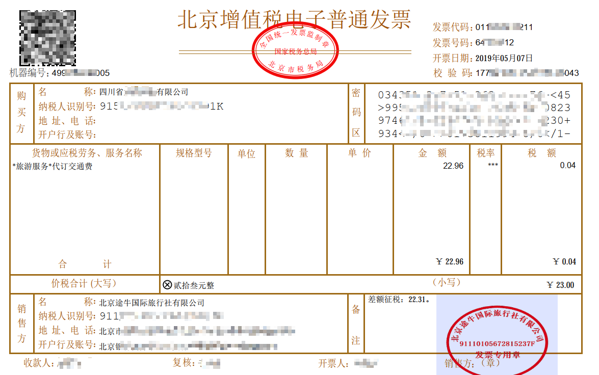
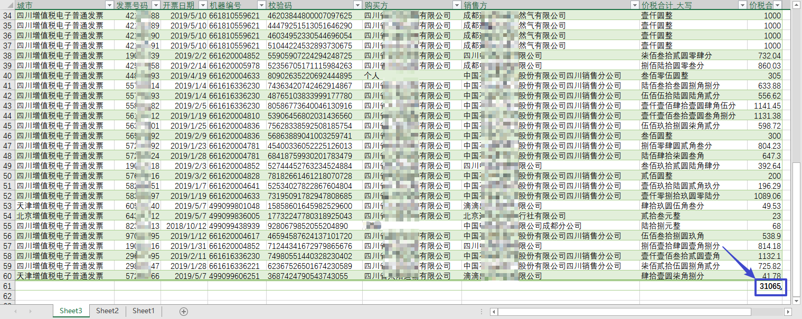

# parse_invoice

## 概述

invoice_parser.py 用于解析"增值税电子普通发票"的 pdf 文件。
脚本使用 `pdfplumber` 库来提取 pdf 中的文本，然后使用正则表达式来匹配文本中的内容。

"增值税电子普通发票"示例:

数据结果展示:

## 参考

- [操作文件和目录 - 廖雪峰](https://www.liaoxuefeng.com/wiki/1016959663602400/1017623135437088)
- [`os.path`](https://docs.python.org/3/library/os.path.html#module-os.path) — Common pathname manipulations
- [`os`](https://docs.python.org/3/library/os.html#module-os) — Miscellaneous operating system interfaces
- [第十四章：文件 - ThinkPython](http://codingpy.com/books/thinkpython2/14-files.html#)
- [`csv`](https://docs.python.org/3/library/csv.html#module-csv) — CSV File Reading and Writing

